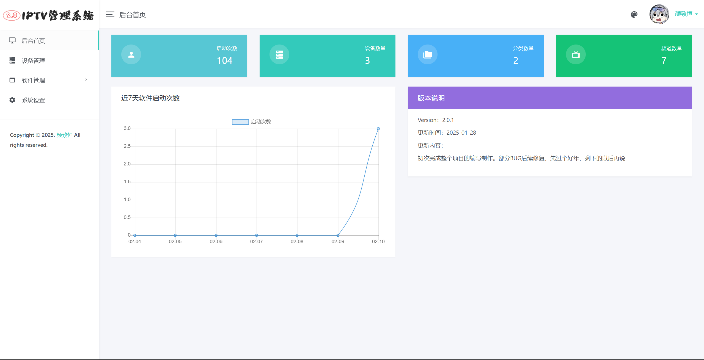
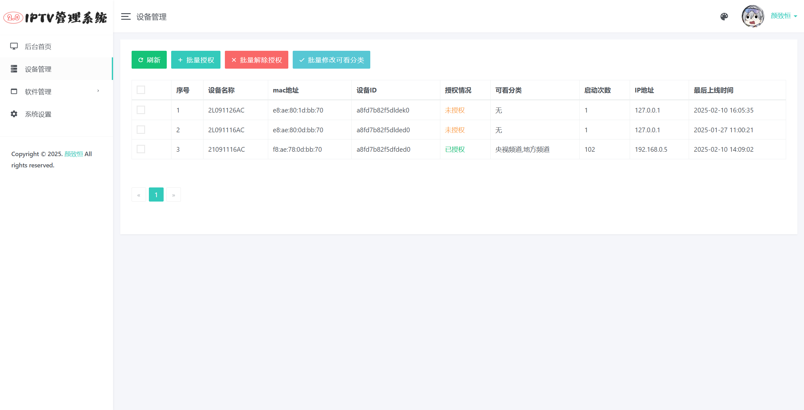
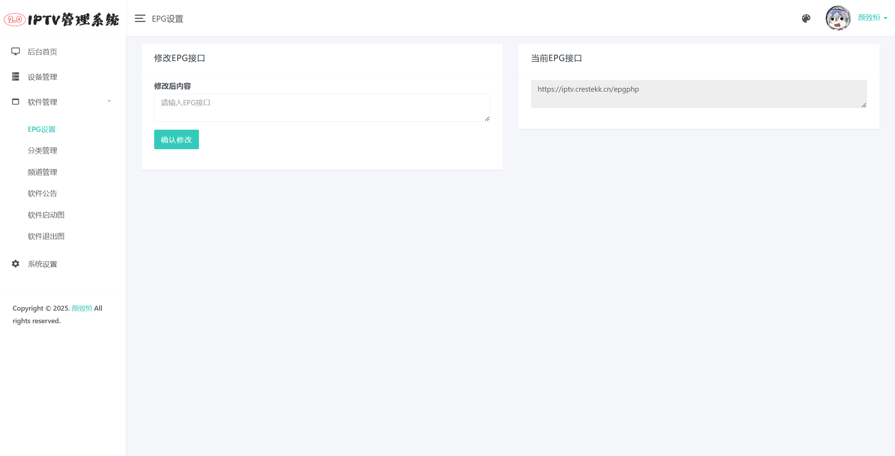
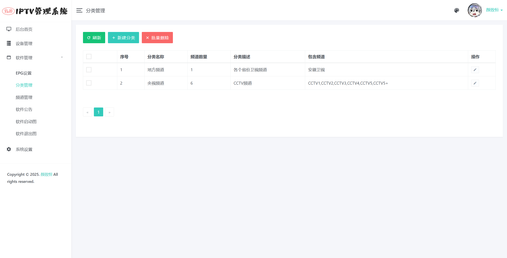
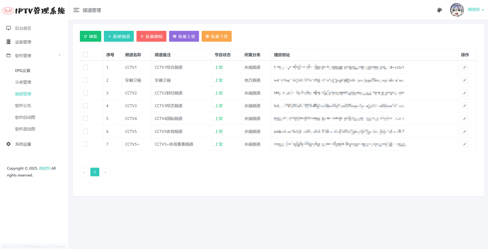
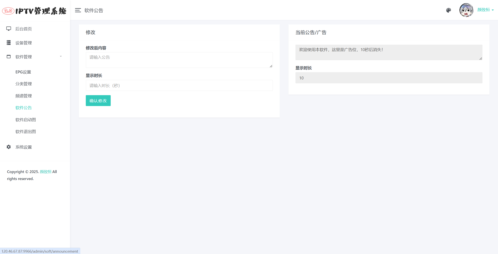
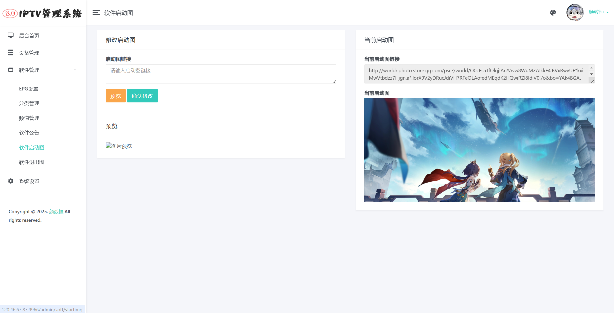
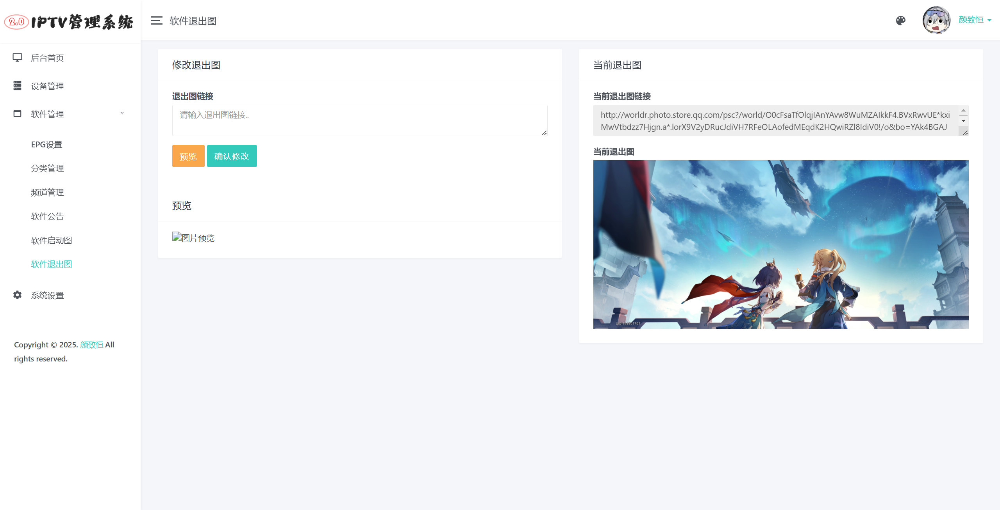
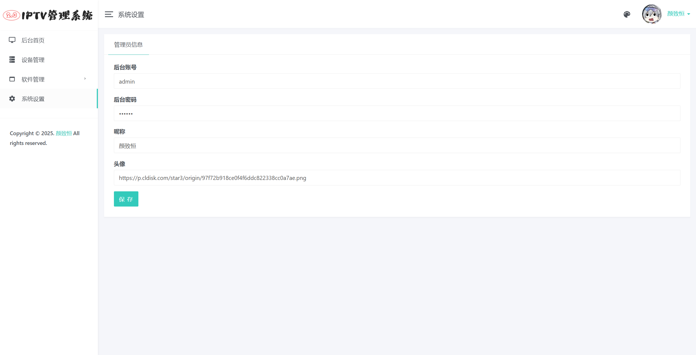

# IPTVadmin2 - 直播源管理
## 项目简介

这是一个电视直播源管理系统，主要用于对接定制的**DIYP影音**，实现定制化的电视直播软件。软件对接教程请看后面。灵感来源于恩山无线论坛内的《IPTV管理系统》，因为有些功能我用这不是很方便，所以自己写了一个，感谢大佬们提供的DIYP软件，我只是根据接口写了后台，大佬们勿喷。

本项目基于 [光年后台管理模板 ](http://lyear.itshubao.com/) 进行开发，感谢大佬的框架能让我开发变得容易一些。

本项目仅为管理系统，**不内置直播源**，谢谢。

同时，这也是我的一个练习性质的项目，代码让我自己评价的话就是：**依托答辩**，不过也不至于不能用。

有什么优化建议可以提出来，大家一起解决（大佬帮我解决最好了）。

我的邮箱：techyzh@qq.com

## 项目截图

* 后台首页：



* 登陆设备管理：



* 设置EPG接口：



* 分类管理：



* 频道管理：



* 软件公告设置：



* 软件启动图/退出出图设置：





* 系统设置：




## 使用方法

1. 先下载源代码，安装python环境（网上教程很多）

2. 执行下面的代码安装基本库

   ```shell
   pip install -r requirements.txt
   ```

3. 打开源代码目录并执行启动命令

   ```shell
   python manage.py runserver 0.0.0.0:8000
   ```

4. 浏览器打开**127.0.0.1:8000/admin/login**即可

## 后续计划

1. 添加从某直播源订阅的功能，就不用一条一条的录入了
2. 写一个一键化部署（可能很久之后才会出，因为不会写代码...）
